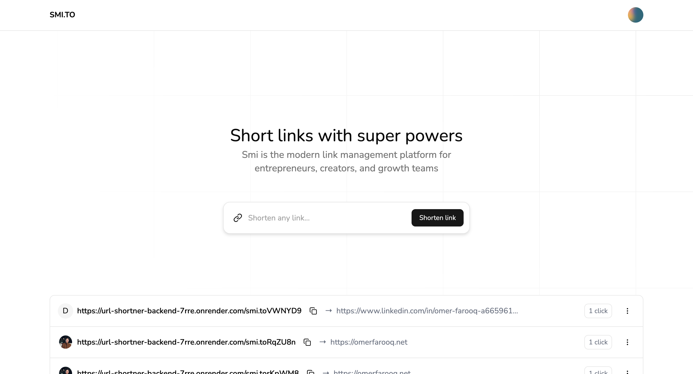

# 🔗 URL Shortener

A simple and modern URL Shortener built with a clean and intuitive UI. This tool allows you to shorten long URLs into compact links that are easy to share and track.

🌐 **Live Demo:** [url-shortner-frontend-alpha-rose.vercel.app](https://url-shortner-frontend-alpha-rose.vercel.app/)

---

## ✨ Features

- 🔗 Shorten long URLs with a single click
- 📋 Copy shortened URLs directly to clipboard
- 📈 View analytics for shortened links
- 🔄 Responsive and mobile-friendly design
- ⚡ Built for speed and ease of use

---

## 🛠️ Tech Stack

- **Frontend:** React, Vite, Tailwind CSS, Shadcn, TypeScript
- **Hosting:** Vercel

---
